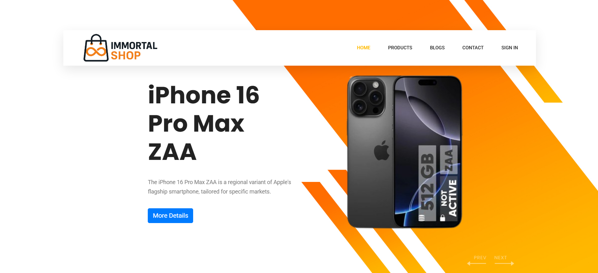
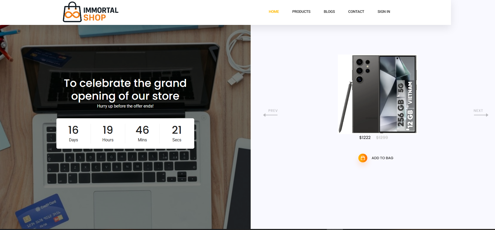
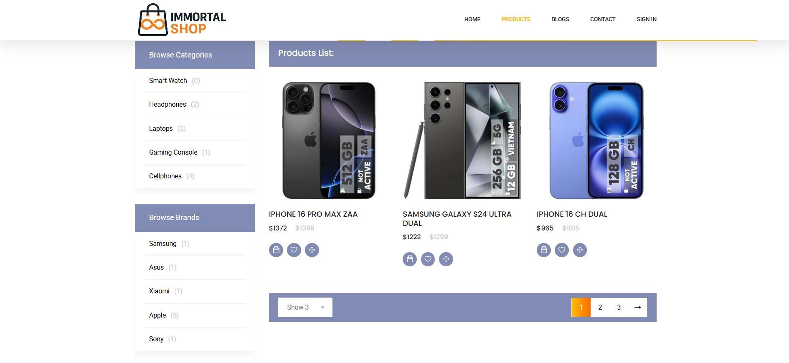
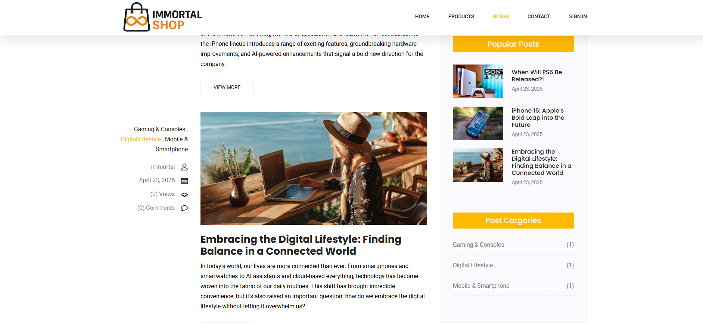
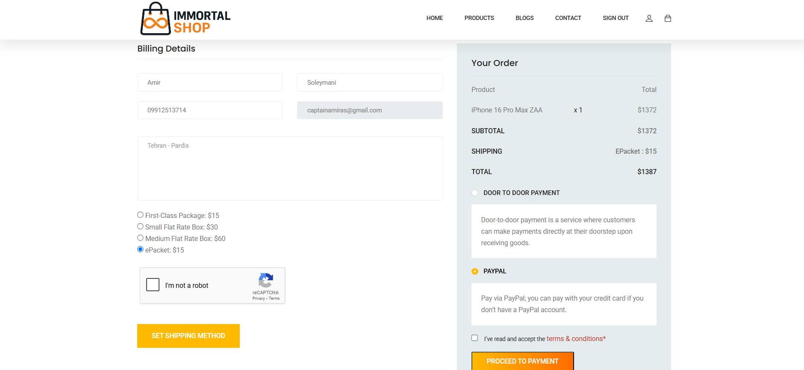
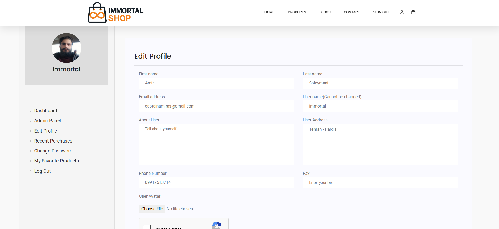

# 🛒 Immortal Kala Shop – Electronics E-Commerce Website

Immortal Kala Shop is a modern and scalable e-commerce web application focused on selling electronic products such as mobile phones, laptops, headphones, game consoles, and more. The platform provides a complete shopping experience, including product listings, article/blog section, custom user dashboard, cart, and secure checkout.

---

## 🚀 Features

- 🔐 User registration & login
- 📦 Product listing and detail pages
- 🛒 Shopping cart and checkout system
- 📚 Blog section for articles and SEO
- 👤 Custom user dashboard
- 📊 Admin panel for managing products, users, and orders
- 📬 Email notifications (via Celery & RabbitMQ)
- 🖥️ Responsive design for mobile and desktop
- 🧠 Optimized async task handling with Celery
- 📦 Dockerized and production-ready setup

---

## 🛠 Tech Stack

- **Backend:** Django
- **Database:** PostgreSQL
- **Cache:** Redis
- **Async Tasks:** Celery + RabbitMQ
- **Monitoring:** Flower (for Celery)
- **Deployment:** Docker, Nginx

---

## 📷 Screenshots

### 🏠 Homepage


### ⏳ Product Offers with Timer


### 📱 Products Listing


### 📰 Blog Section


### 🛒 Shopping Cart


### 👤 User Profile / Dashboard


---

## 📦 Deployment

This project is fully containerized using Docker and Docker Compose.

To run locally or on your server:

```bash
docker-compose up --build
